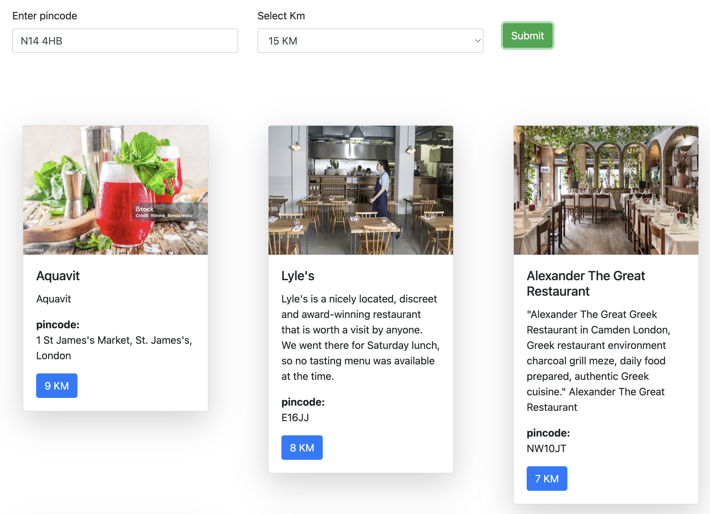

# Geolocalization

This is a simple Django project that demonstrates how to use the `geopy` library to calculate the distance between two locations using different parameters for localization.

You can provide different values as 'pincode' as listed below:
- latitude and longitude
- address
- city
- country
- postal code

The project includes a simple API endpoint that retrieves nearby restaurants based on the user's pincode and radius (in kilometers). The API calculates the distance between the user's location and each restaurant using the `geopy.distance.great_circle` function.

The project also includes a Vue.js frontend that allows users to enter their pincode and select a radius (in kilometers) to search for nearby restaurants. The frontend makes an AJAX request to the API endpoint and displays the list of restaurants along with their details and distances from the user's location.

## Running the Project Locally with Docker
clone the repository and navigate to the project directory.

and run the following command to build and start the Docker container:
```
docker-compose up --build
```

navigate to `http://localhost:8000` in your web browser to access the application.


## Images

### Search


### Results by Postal Code


### Results by Address


### Results by City


### Results by Country


### Results by Landmark


### Results by Latitude and Longitude

